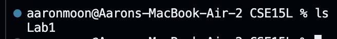

1. cd (no arguments):
- 
- The absolute path of the working directory right before the command was run was `/Users/CS/CSE15L`.
- The output I got was that there was no listed directory after using the `cd` command. What happened was that when `cd` was run without an argument, it was moved to the home directory regardless of whatever was the absolute directory/path.
- It is not an error.

2. cd (path to directory)
- 
- The absolute path of the working directory right before the command was run was `/Users/CS/CSE15L` .
- The output that I received after running `cd` with a path to directory was Lab1 meaning the absolute path has changed from CSE 15L to the folder Lab1 that was inside the CSE 15L folder.
- It is not an error.

3. cd (path to file)
- 
- The absolute path of the working directory right before the command was run was `/Users/CS/CSE15L/Lab1`.
- The output after I ran `cd` with a path to a folder named test.txt returned an error message saying that there was no file or directory. The command `cd` is used to navigate around direcotories/files to access such files, hence why the command did not work when trying to use it on files.
- This is an error because `cd` is used to navigate around directories, not access files.

4. ls (no arguments)
- 
- The absolute path of the working directory right before the command was run was `/Users/CS/CSE15L`.
- The output after I ran the `ls` without an argument resulted simply in the `Lab1` being listed. The command `ls` without an argument simply listed anything that was contined within that current directory.
- It is not an error.

5. ls (path to directory)
- 
- The absolute path of the working directory right before the command was run was `/Users/CS/CSE15L`.
- The output after running the `ls` command with `lab1`, a directory right after it resulted in the listing of `lab1`'s contents which was just the `test.txt` file.
- It is not an error.

6. ls (path to file)
- 
- The absolute path of the working directory right before I run the command for the first time was `/Users/CS/CSE15L` however the second time I ran it it was `/Users/CS/CSE15L/Lab1`.
- The output after the first time I ran `ls` with a path to a file was an error because a file did exist within that specific directory. However the second time I ran it the same file was outputted. When using `ls` on a file within the working directory, what will be listed is the same file.
- It is not an error.

7. cat (no arguments)
- 
- The absolute path of the working directory right before I run the command is `/Users/CS/CSE15L`.
- I did not receive a single output after running the command `cat`. This is because there is no read within the directory hence why there is not output being made.
- It is not an error because it is correctly doing its function. There is just nothing for the `cat` command to read hence why no ouput.

8. cat (path to directory)
- 
- The absolute path of the working directory right before I run the command is `/Users/CS/CSE15L`.
- The output that I receive after using the command with a path to a directory outputs that the directory I attempted is a directory. This is because the command `cat` is used to show the contents of a file and not a directory.
- It is not an error.

9. cat (path to file)
- 
- The absolute path of the working directory right before I run the command is `/Users/CS/CSE15L/Lab1`.
- The output that I receive is `Hello World`, which is exactly what I have put inside of the file. Running the command `cat` with a path to the file listed the contents inside of it that was also all within the working directory.
- It is not an error.
