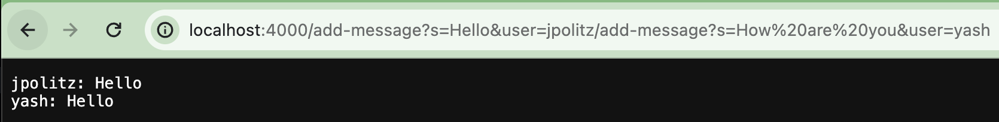

Part 1:

  Code:  
  - screenshot #1: 
    - The `handleRequest` method is being is being called.
    - In the `handleRequest` method, the argument `url` represents the requested URL. The value of the relevant field is   `fullMessage`.
    - The value of `fullMessage` will be updated as it the inputs for `user` and `message` is added together.

  - screenshot #2: 
    - The `handleRequest` method is being is being called.
    - In the `handleRequest` method, the argument `url` represents the requested URL. The value of the relevant field is   `fullMessage`.
    - The value of `fullMessage` will be updated as it the inputs for `user` and `message` is added together.

Part 2: 

  1. screenshot: 
  2. screenshot: 
  3. screenshot: 

Part 3: 

  Something new that I learned was how to access and work on code on the server side and not only locally. Through connecting to ieng6 using my school account and the school servers, I am able to access code remotely from any device using the server. 
