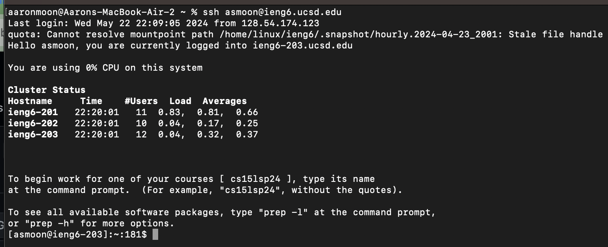
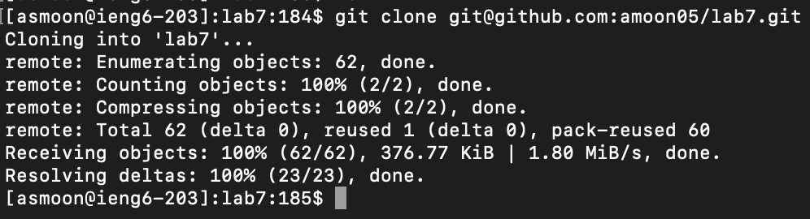
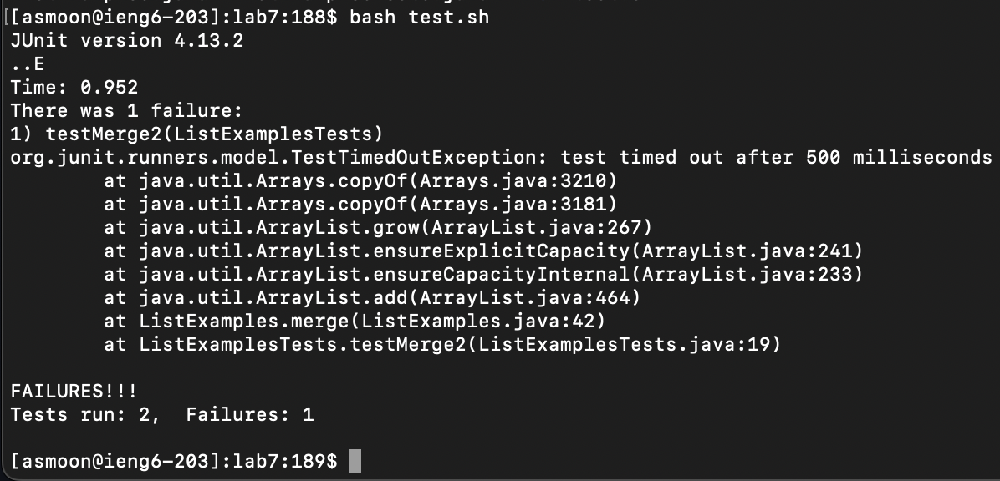
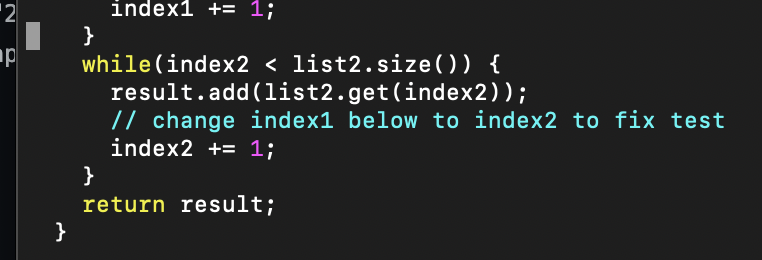
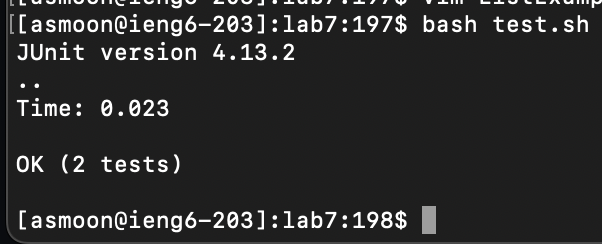
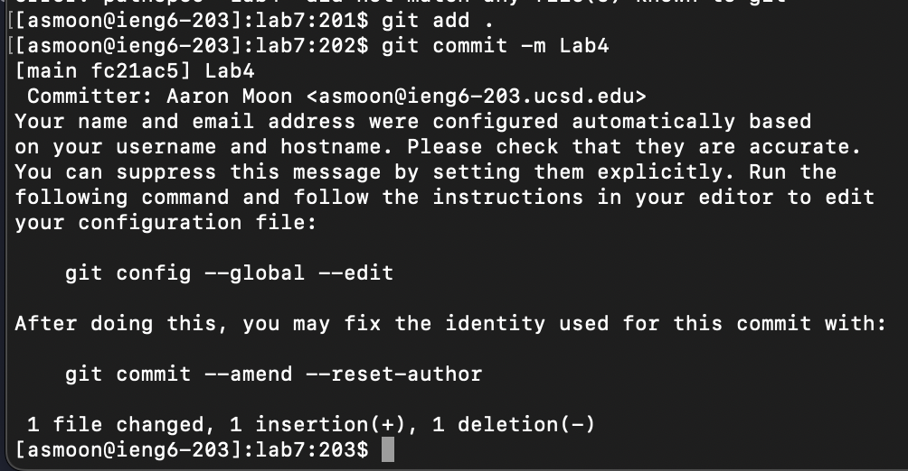

Step 4: 

Step 5: 

Step 6: 

Step 7: The starting point of the "vim" is line above the last while loop as shown in the screenshot. The screenshot shows the fix in the error and the steps taken are listed below.
 
        1. <down><down><down><down>
        2. <right><right><right><right><right><right><right><right><right><right><right>
        3. press<x> to remove "1" from "index2"
        4. press<i>
        5. add "2" to "index"
        6. <escape> 
        7. `:wq`

Step 8: 

Step 9: 
